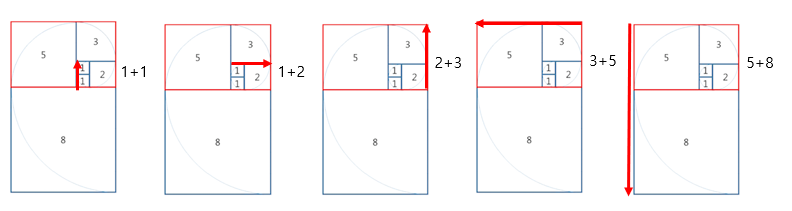
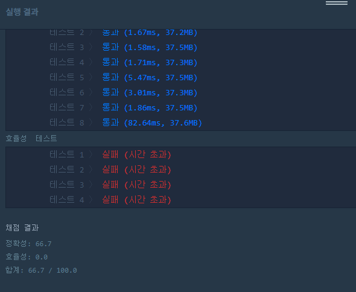
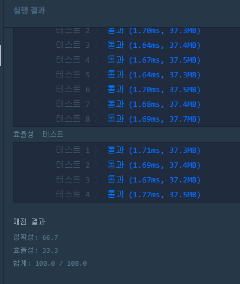

## algorithm workspace

# 2020/05/26

[소스코드(Java)](./GetMidCharacter/src/GetMidCharacter.java)

[소스코드(Kotlin)](./GetMidCharacter/src/getMidCharacter.kt)

- 문자열이 주어지면, 중간의 글자를 반환하기(글자수가 짝수면 가운데 두 글자.)

1. (length-1)/2 글자수를 뽑아냄.
2. 짝수라면 그 다음 글자를 뽑아냄.

# 2020/05/25

[소스코드](./pAndYCounter/src/PAndYCounter.java)

- 문제 : 문자열이 주어지면 p,y(대소문자 구분 x)의 개수를 세어 같으면 true, 다르면 false 반환하기.

1. 문자열을 소문자로 바꾼다.(대문자도 상관없음.)
2. 알파벳 p, y의 개수를 센다.
3. 같으면 true 반환한다.

# 2020/05/27

- 문제 : 정사각형의 타일을 달팽이 모양으로 한변이 1인 타일부터 N개를 점점 큰 타일을 이어 붙이고 N개를 이어붙였을 때, 타일의 테두리의 길이를 구해라.



귀납법으로 다음 타일의 한변의 길이는 피보나치 수열을 따르는 것을 확인할 수 있다.  
[1, (여기부터) 1, 2, 3, 5, 8, 13, 21, …]

먼저, 피보나치 수열의 점화식을 세운다.
F(0) = 0, F(1) = 1, F(n+2) = F(n+1) + F(n)

그리고 답을 구하는 공식은 직사각형 여섯 변의 길이를 더하면 완료된다.  
N = 4: answer = 3+3+3+3+2+2 = 16  
N = 5: answer = 5+5+5+5+3+3 = 26  
N = 6: answer = 8+8+8+8+5+5 = 42  

그러나 하나의 규칙을 확인 할 수 있는데  
F(4) = 8 / answer = F(6) \* 2 = 16;  
F(5) = 13 / answer = F(7) \* 2 = 26;  
F(6) = 21 / answer = F(8) \* 2 = 42;  

귀납적으로 접근 하였을때 F(N+2)\*2가 문제에서의 답이 될 수 있다는 것을 알아낼 수 있다.

이를 증명하는 것을 그림으로 표현하면  


따라서 아래와 같이 코드를 짰지만

```javascript
function solution(N) {
    let answer = 0;
    answer = fibo(N+2) * 2;
    return answer;
}

function fibo(N) {
    if(N === 0) return 0;
    else if(N === 1) return 1;
    else return fibo(N-1) + fibo(N-2);
}
```



N이 커질수록 믿을 수 없을 정도로 느려지는 것을 확인 할 수 있다.

이는 근본적으로 함수 호출 스택으로 인해 당연히 더많은 공간과 시간을 소요한다. 그러나 이경우는 자바스크립트° 상에서 **함수의 콜백(CallBack)이 깊어 질수록 현저히 느려진다** 라고 해석할 수 있으며
재귀함수를 쓰지 않고 반복문으로 다시 접근해야할 필요를 느낄 수 있다.

주어지는 N는 1~80 이기에 0은 고려할 필요가 없다. 따라서  
N = 1일때 answer = 4가 나오기 위해서는 피보나치 수가 2여야 된다. 따라서 초기값을 1로 세팅을 하고 N번만큼 반복문을 돌게하면 비용을 줄일 수 있다.


```javascript
function solution(N) {
  let answer = 0;
  let prev = 1;
  let now = 1;

  for (var i = 0; i < N; i++) {
    answer = prev + now;
    prev = now;
    now = answer;
  }

  answer += answer; // answer *= 2;
  return answer;
}
```


